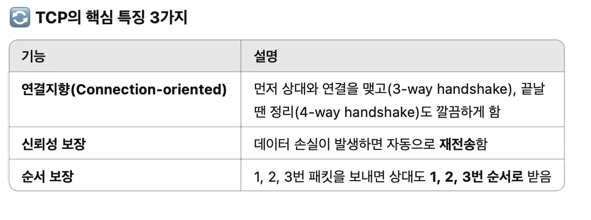
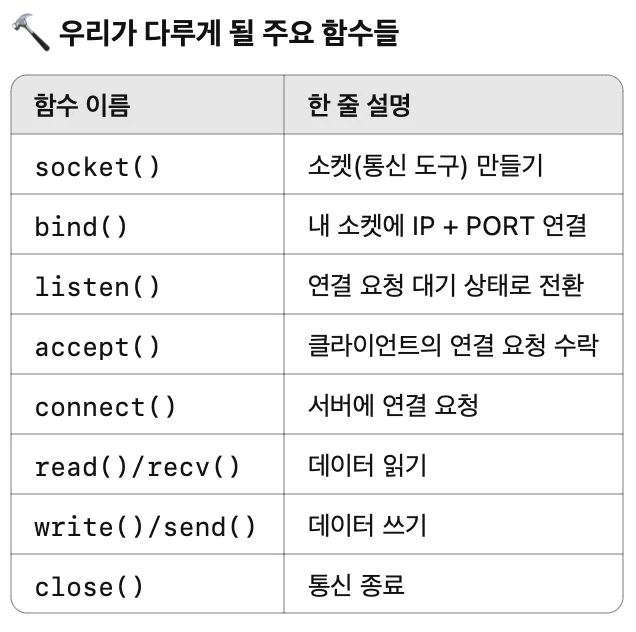
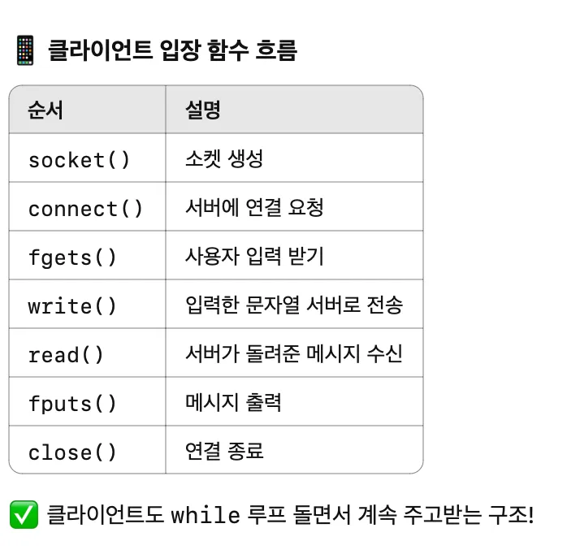

# 네트워크 프로그래밍

: 네트워크로 연결된 둘 이상의 컴퓨터 사이에서 데이터 송수신 프로그램 작성 의미. 소켓 기반으로 프로그래밍

<aside>
💡

소켓 : 네트워크 연결 도구

### **TCP란?**

**TCP (Transmission Control Protocol)**

→ 데이터를 **안전하고 정확하게** 주고받기 위한 **“연결지향형”** 프로토콜이야.

SOCKET_STREAM

> “내가 보낸 메시지가 잘 도착했는지 확인하고 싶어!” → 그럴 때는 무조건 TCP
> 

### **TCP 통신의 흐름 구조**

**📞 TCP 통신은 전화 거는 과정이랑 비슷함.ᐟ**

1. **서버는 대기 중** (전화 받을 준비)
2. **클라이언트가 전화함** (연결 요청)
3. **서버가 받음** (연결 수락)
4. **둘이 통화함** (데이터 송수신)
5. **한쪽이 끊음** (종료)

**💻 서버 입장**

```c
socket()      // 전화기 장만
bind()        // 전화번호 등록 (IP + PORT)
listen()      // 전화 받을 준비 완료
accept()      // 전화 받기
read()/write() // 통화 (데이터 주고받기)
```

**📱 클라이언트 입장**

```c
socket()      // 전화기 장만
connect()     // 전화 걸기
read()/write() // 통화 (데이터 주고받기)
```



### **인터넷 주소 & 포트**

**🌍 IP 주소란?**

- 인터넷상에서 컴퓨터를 식별하기 위한 주소
- IPv4 (4바이트), IPv6 (16바이트)

**🧱 PORT 번호란?**

- 한 컴퓨터 내에서 소켓을 구분하기 위한 번호
- 065535 (01023은 well-known 포트)

**📦 구조체 sockaddr_in 설명**

- sin_family: 주소 체계 (AF_INET 등)
- sin_port: 포트 번호 (네트워크 바이트 순서)
- sin_addr: IP 주소
- sin_zero: 의미 없음, 0으로 채움

### **🧭 바이트 순서 & 네트워크 바이트 순서**

**📌 빅 엔디안 (Big Endian)**

- 상위 바이트를 **작은 번지수**에 저장 (네트워크 기준!)
- 예: 0x12345678 → 12가 가장 앞에

**📌 리틀 엔디안 (Little Endian)**

- 상위 바이트를 **큰 번지수**에 저장
- 예: 0x12345678 → 78이 가장 앞에

**📌 호스트 바이트 순서**

- CPU별 데이터 저장 방식 (OS나 컴퓨터 구조에 따라 다름)

**📌 네트워크 바이트 순서**

- **통신 표준**
- 항상 **빅 엔디안**을 기준으로 함
    
    → 데이터 전송 전에 반드시 호스트 바이트 순서를 네트워크 바이트 순서로 변환해야 함!
    

---

### **🔁 바이트 순서 변환 함수**

| **함수** | **역할** |
| --- | --- |
| htons() | host(리틀 엔디안)→ network(빅 엔디안) (short형 == 16비트) / 처음부터 빅 엔디안 일시 그냥 빅 엔디안 유지 |
| htonl() | host → network (long형 == 32비트) |
| ntohs() | network → host (short형) |
| ntohl() | network → host (long형) |

---

### **🌐 주소 변환 관련 함수**

**📌 inet_addr()**

- "127.0.0.1" 같은 문자열 IP → 4바이트 숫자로 변환
- 결과: 정수형 IP 주소 반환
- 단, **byte 순서를 바꿔서 저장함 (주의!)**

**📌 inet_aton()**

- 위 함수와 동일한 역할 (더 안전하고 엄격한 버전)
- **값을 저장**한다는 점에서 차이
- 리턴값: 성공 여부 (정수)

**📌 inet_ntoa()**

- 숫자 형태의 IP 주소 → 문자열로 다시 바꿔줌
- IP를 사람이 읽을 수 있도록 표시

- **WSAStringToAddress**
    - inet_addr과 비슷하지만, 주소와 포트번호가 같이 있는거 허용 (**1.2.3.4:9000**)
- **WSAAddressToString**
    - inet_ntoa와 비슷하지만, 주소와 포트번호가 같이 있는거 허용 (**1.2.3.4:9000**)

---

### **🧱 sockaddr 구조체와 주소 설정**

**struct sockaddr_in을 사용할 때 주의사항**

- IPv4용 소켓 주소는 SOCKADDR_IN으로 정의
- bind 시에는 sockaddr*로 캐스팅해서 사용해야 함

```
struct sockaddr_in serv_addr;
serv_addr.sin_family = AF_INET;
serv_addr.sin_addr.s_addr = htonl(INADDR_ANY); // 모든 IP 허용
serv_addr.sin_port = htons(atoi(serv_port));
```

---

### **🧠 INADDR_ANY란?**

- 현재 실행 중인 컴퓨터의 **모든 IP 주소에서 접근 가능**
- 서버에서 클라이언트 요청을 다 수락할 수 있도록 설정하는 상수

---

### **🔧 서버 주소 바인딩 예시**

```
int serv_sock;
struct sockaddr_in serv_addr;
char* serv_port = "9190";

// 소켓 생성
serv_sock = socket(PF_INET, SOCK_STREAM, 0);

// 주소 설정
memset(&serv_addr, 0, sizeof(serv_addr));
serv_addr.sin_family = AF_INET;
serv_addr.sin_addr.s_addr = htonl(INADDR_ANY);
serv_addr.sin_port = htons(atoi(serv_port));

// 바인딩
bind(serv_sock, (struct sockaddr*)&serv_addr, sizeof(serv_addr));
```

**📌 이건 TCP 서버에서 기본적으로 사용하는 포맷!**

---

### **UDP (User Datagram Protocol)**

**TCP와 UDP 비교**

- UDP는 **비연결형 프로토콜**로 TCP와 다르게 연결 개념 없음
- 확인 메시지(SEQ, ACK) 없음 → **Flow Control 없음**
- 데이터 전송 순서 및 손실에 대한 보장 X
- 실시간성이 중요한 서비스에 적합 (음성, 영상 등)
- SOCKET_DGRAM

### **⚙️ UDP 주요 함수 설명**

**📥 recvfrom() 함수**

- 데이터를 수신하고 **송신자 정보도 함께 전달받음**
- 주요 파라미터:
    - from: 보낸 측 주소 정보 저장할 구조체
    - addrlen: 주소 길이
- 연결 개념 없음 → 매번 수신할 때 송신자 정보 포함 필요

**📤 sendto() 함수**

- 데이터를 송신하며 **수신자 주소를 명시**
- 주요 파라미터:
    - to: 받을 측 주소 정보
    - addrlen: 주소 구조체의 크기

✅ 요약: **recvfrom은 누가 보냈는지 알려주고**, sendto는 **어디로 보낼지 직접 지정**

---

### **🧱 UDP의 데이터 경계 처리**

- UDP는 **데이터 단위(패킷) 경계가 존재**
- recvfrom()을 호출할 때마다 **한 개의 패킷만 수신됨**
- 예: sleep() 중에도 메시지가 오면 3개 중 3개 모두 개별로 도착함
    
    → **TCP와 달리 뭉쳐서 오는 게 아님**
    

---

### **🚧 UDP vs TCP 함수 차이**

- TCP는 연결 기반이라 send, recv만 쓰고 대상 지정 X
- UDP는 비연결이므로 sendto, recvfrom으로 **매번 주소 지정 필요**

---

### **🔗 Connected UDP 소켓?**

- connected UDP 소켓은 **TCP처럼 연결된 건 아니지만**
- 소켓의 **목적지를 미리 설정**한 상태
- 이후엔 send, recv로만 사용 가능 (주소 매번 지정 안 해도 됨)

### **🧪 양방향 통신: 에코 서버 & 클라이언트**

**에코 통신이란?**

> 클라이언트가 입력한 문자열을 서버가 그대로 받아서 돌려보내는 구조
> 



### **🔚 소켓의 우아한 종료 (Half-Close & shutdown())**

**✅ 일반적인 close()의 한계**

- 우리가 평소에 쓰던 close()는 **양쪽 스트림 모두 종료**함
- 문제는?
    
    → 상대방이 아직 데이터를 보내고 있을 수도 있음
    
    → 일방적인 종료로 **데이터 유실** 가능성 있음 😱
    

**🧠 그래서 등장한 개념: Half-Close**

- TCP는 데이터를 **주고받는 방향**이 따로 있음
- → 그럼 **읽기만 끊거나**, **쓰기만 끊는 게 가능하지 않을까?**

이걸 가능하게 해주는 함수가 바로 **shutdown()**

입력 스트림 만 종료 / 출력 스트림 만 종료 가능


### **🌐도메인**

**도메인이 뭐냐?**

우리가 흔히 접하는 웹 주소: www.google.com, www.naver.com 같은 것들

이건 **사람이 보기 쉽게 만든 주소임**

실제 통신은 **IP 주소(숫자)** 기반으로 이루어짐

그래서 도메인 → IP 주소 이걸 처리하는 게 **DNS (Domain Name System)**

**🧠 DNS의 역할**

> 도메인 이름을 IP 주소로 바꿔주는 시스템
> 

**🔧 도메인 → IP로 바꾸기: gethostbyname()**

```c

struct hostent* gethostbyname(const char* name);
```

**🔁 IP → 도메인으로 바꾸기: gethostbyaddr()**

```c
struct hostent* gethostbyaddr(const void* addr, socklen_t len, int type);

```

**❓gethostbyname()은 DNS의 종류인가?**

→ **아님!** 

gethostbyname은 **DNS의 종류가 아니라**, **DNS를 사용하는 C함수 중 하나임!**

gethostbyaddr()은 방향이 반대 

📦 즉, IP 주소의 **역방향 조회(Reverse DNS Lookup)** 역할

</aside>